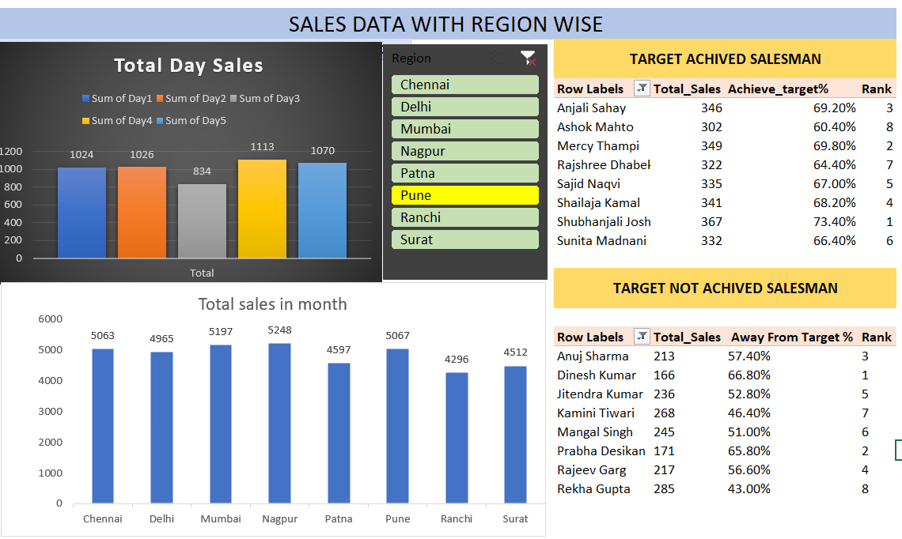

# 📊 Sales Dashboard Analysis – Regional Performance & Target Achievement

## 🧠 Overview

This project analyzes clean sales data across multiple cities and salespeople. The dashboard provides insights into:

Total sales by day and month

Regional filtering via slicers

Salesperson performance: target achieved vs not achieved

Top 8 achievers and non-achievers ranked by target percentage

No data transformation was required—source data was clean and directly used in PivotTables and slicers.

## 🗂️ Dataset Summary

Cities covered: Chennai, Delhi, Mumbai, Nagpur, Patna, Pune, Ranchi, Surat

Sales metrics: Day-wise totals, monthly totals

Salesperson metrics: Total sales, % target achieved, rank

## 📌 Key Features

Slicer-based filtering by region (city)

Dynamic linkage of salespeople to their respective regions

PivotTable logic used to rank top 8 achievers and non-achievers

No transformation or cleaning required—data was analysis-ready

## 🏆 Ranking Logic

Achieved Target Table: Ranked by % Achieve_target descending

Away Target Table: Ranked by % Achieve_target ascending

Rank field added as a value in PivotTable (not slicer-compatible)

Manual filtering or helper column used to isolate Rank 1–5

## 📷 Dashboard Preview

